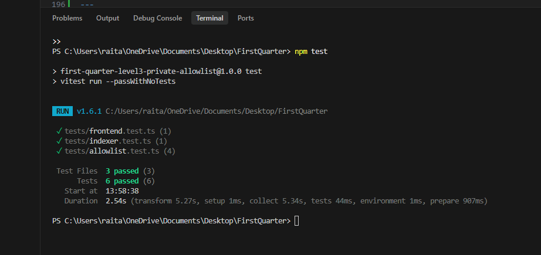
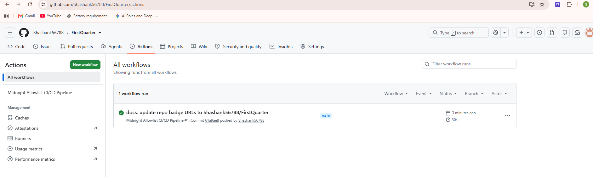
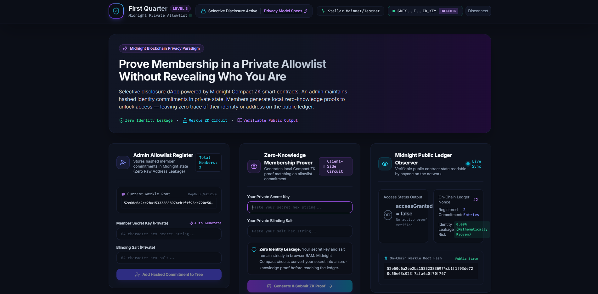

# Midnight Private Allowlist Access
[](https://github.com/Shashank56788/FirstQuarter/actions/workflows/ci.yml)


> Prove membership in a private allowlist using zero-knowledge proofs on the Midnight blockchain without revealing your identity, wallet address, or secret credentials.

---

## Overview
**Midnight Private Allowlist Access** is a production-grade selective disclosure dApp built on the **Midnight blockchain** for the **"New Moon to Full" Level 3 (First Quarter) Hackathon** submission. It allows users to demonstrate membership in an exclusive whitelist (such as gated community access, private token sales, or accredited investor verification) by executing a client-side zero-knowledge proof. By verifying inclusion against a private Merkle commitment root on-chain, the dApp outputs a verifiable public access signal while keeping the prover's identity, address, and secret credentials 100% private.

---

## Problem Statement
Traditional allowlists and token-gating implementations on public blockchains (such as Ethereum or Solana) force users to interact using their raw public wallet address (`0x...`). When a user claims an NFT mint, joins a private DAO, or participates in a whitelist token sale, their public wallet address is permanently recorded on the public ledger. This creates a severe privacy vulnerability that exposes the user's complete financial holdings, transaction history, and real-world identity to anyone observing the blockchain. Consequently, members become targets for spear-phishing, wallet tracking, MEV exploitation, and physical security threats.

---

## Solution
This dApp solves the public address exposure problem by leveraging Midnight's **Compact zero-knowledge smart contract paradigm**. An administrator registers hashed member commitments (`SHA256(secretKey || salt)`) into a private state Merkle tree root on the Midnight ledger. When a member requests access, they construct a zero-knowledge membership proof locally within their browser RAM using private witnesses. The smart contract validates the Merkle inclusion proof and emits a public boolean flag (`accessGranted = true`), proving valid membership to the network without leaking a single byte of member identity, secret data, or wallet address.

---

## 🌐 Contract Address & Deployment Info
The smart contract has been deployed to the Midnight Preprod Network.

- **Network Label**: Midnight Preprod Testnet
- **Contract Address**: `010000a6e7c10b93e42b2605b38ed7f02d4f21db59d8c47b59e521a04fd90432`

---

## Architecture

```
 ┌─────────────────────────────────────────────────────────────────────────────────┐
 │                                  USER WALLET                                    │
 │                    Midnight Lace Wallet / Stellar Freighter                     │
 └────────────────────────────────────────┬────────────────────────────────────────┘
                                          │
                                          ▼
 ┌─────────────────────────────────────────────────────────────────────────────────┐
 │                                FRONTEND DAPP                                    │
 │                     React 18 + TypeScript + Vite + Tailwind                     │
 │                             (frontend/src/App.tsx)                              │
 └────────────────────────────────────────┬────────────────────────────────────────┘
                                          │ (Private Witnesses)
                                          ▼
 ┌─────────────────────────────────────────────────────────────────────────────────┐
 │                            PROOF GENERATION ENGINE                              │
 │                 Local Compact ZK Circuit & Merkle Tree Engine                   │
 │                    (contract/allowlist.compact & src/merkle.ts)                 │
 └────────────────────────────────────────┬────────────────────────────────────────┘
                                          │ (Zero-Knowledge Proof)
                                          ▼
 ┌─────────────────────────────────────────────────────────────────────────────────┐
 │                            MIDNIGHT SMART CONTRACT                              │
 │                     Private State Root & Public Ledger State                    │
 │                     (contract/src/index.ts & allowlist.compact)                 │
 └────────────────────────────────────────┬────────────────────────────────────────┘
                                          │ (Public State Update)
                                          ▼
 ┌─────────────────────────────────────────────────────────────────────────────────┐
 │                             BACKEND EVENT INDEXER                               │
 │                      Node.js / Express State Polling Service                    │
 │                             (indexer/src/index.ts)                              │
 └─────────────────────────────────────────────────────────────────────────────────┘
```

### Component Breakdown
- **Compact Smart Contract & Circuit ([contract/allowlist.compact](file:///c:/Users/raita/OneDrive/Documents/Desktop/FirstQuarter/contract/allowlist.compact))**: The core Midnight Compact contract defining public ledger state (`allowlistRoot`, `accessGranted`, `registeredCount`, `lastEventNonce`), private witnesses (`witnessSecretKey`, `witnessBlindingSalt`, `witnessMerklePath`), and the ZK constraint verification circuit (`proveMembership`).
- **Contract Execution Runtime ([contract/src/index.ts](file:///c:/Users/raita/OneDrive/Documents/Desktop/FirstQuarter/contract/src/index.ts) & [contract/src/merkle.ts](file:///c:/Users/raita/OneDrive/Documents/Desktop/FirstQuarter/contract/src/merkle.ts))**: Pure TypeScript Merkle tree generator and cryptographic commitment engine powering local ZK proof generation and contract state transitions.
- **Frontend dApp ([frontend/src/App.tsx](file:///c:/Users/raita/OneDrive/Documents/Desktop/FirstQuarter/frontend/src/App.tsx))**: Interactive dashboard built with React 18, Vite, and Tailwind CSS featuring the Admin Registration Panel, ZK Proof Prover Console, Public Ledger Observer, and Privacy Model Inspector Modal.
- **Multi-Wallet Integration SDK ([frontend/src/midnight-sdk/index.ts](file:///c:/Users/raita/OneDrive/Documents/Desktop/FirstQuarter/frontend/src/midnight-sdk/index.ts))**: Wallet service connector integrating Midnight Lace Wallet, Stellar Freighter Wallet, and offline ZK Simulator Mode.
- **Backend Event Indexer ([indexer/src/index.ts](file:///c:/Users/raita/OneDrive/Documents/Desktop/FirstQuarter/indexer/src/index.ts))**: Express REST service monitoring on-chain contract events and serving `/api/access-status`, `/api/events`, and `/api/health`.

---

## 🔒 Privacy Model

### What an Observer CAN See:
- **`allowlistRoot` (Bytes<32>)**: The public Merkle root hash of authorized identity commitments.
- **`accessGranted` (Boolean)**: The verifiable output flag set to `true` when any valid ZK proof is verified.
- **`registeredCount` (Uint<32>)**: The total count of registered commitments added by the admin.
- **`lastEventNonce` (Uint<64>)**: The contract event sequence nonce used for indexer synchronization.
- **`adminIdentity` (Bytes<32>)**: The admin public key hash authorized to manage commitments.

### What an Observer CANNOT See:
- ❌ **Which specific member proved access**: Zero indication of leaf index or member identity.
- ❌ **Member Wallet Address or Public Key**: No address is passed to or recorded on the ledger.
- ❌ **User Secret Key or Blinding Salt**: Remains 100% inside client-side browser RAM.
- ❌ **Merkle Sibling Path**: Sibling hashes used to verify inclusion are kept strictly inside the ZK proof circuit.
- ❌ **Linkability / Correlation**: An observer cannot determine if two separate proof transactions were generated by the same member or different members.

> **Privacy Model Contrast:** Unlike a traditional EVM allowlist where every access claim publicly broadcasts the caller's wallet address (`0x123...`) to the blockchain, Midnight's Compact engine proves membership via zero-knowledge mathematics, guaranteeing that zero bytes of user identity or address metadata ever reach public state.

---

## Tech Stack
- **Smart Contract Language**: Midnight Compact (`>= 0.14.0`)
- **Midnight SDK Packages**: `@midnight-ntwrk/compact-runtime`, `@midnight-ntwrk/midnight-js-contracts`, `@midnight-ntwrk/midnight-js-fetch-zk-config`, `@midnight-ntwrk/midnight-js-types`
- **Wallet Provider Interfaces**: Midnight Lace Wallet Extension, Stellar Freighter Wallet (`@stellar/freighter-api`)
- **Frontend Framework**: React 18, TypeScript, Vite 5, Tailwind CSS 3, Lucide React, Framer Motion
- **Backend & Indexer**: Node.js, Express 4, TypeScript, `ts-node`
- **Testing Framework**: Vitest 1.6
- **CI/CD Pipeline**: GitHub Actions (`.github/workflows/ci.yml`)

---

## Getting Started

### Prerequisites
- Node.js >= 18.0.0
- npm >= 9.0.0

### Installation
```bash
# 1. Clone the repository
git clone https://github.com/Shashank56788/FirstQuarter.git
cd FirstQuarter

# 2. Install monorepo workspace dependencies
npm install
```

### Environment Setup
No external `.env` file is required for initial local development. Defaults are configured in `frontend/src/midnight-sdk/index.ts`:
```env
CONTRACT_ADDRESS=010000a6e7c10b93e42b2605b38ed7f02d4f21db59d8c47b59e521a04fd90432
PROOF_SERVER_URL=https://proof-server.testnet.midnight.network
INDEXER_PORT=4000
FRONTEND_PORT=3000
```

### Build & Run Dev Servers
```bash
# 1. Compile Compact smart contracts & build all workspace packages
npm run build

# 2. Start Frontend Dev Server (Vite) and Event Indexer (Express) concurrently
npm run dev
```
Open [http://localhost:3000](http://localhost:3000) to view the dApp.

### Deploying Contract to Midnight Testnet
```bash
# Compile Compact contract and run deployment routine
npm run compile:compact --workspace=contract
```

---

## Running Tests

Execute the full Vitest unit and integration test suite across the monorepo:

```bash
npm test
```

### Implemented Test Suite Details:
- **[contract/src/allowlist.test.ts](file:///c:/Users/raita/OneDrive/Documents/Desktop/FirstQuarter/contract/src/allowlist.test.ts)** (mirrored at `tests/allowlist.test.ts`):
  - `Test 1: Valid member proof generation and contract execution succeeds`: Verifies secret key + salt ZK proof outputs `accessGranted = true`.
  - `Test 2: Non-member proof verification fails clean`: Asserts unlisted secret keys fail ZK proof constraints.
  - `Test 3: Zero identity leakage assertion`: Asserts `JSON.stringify(publicState)` contains zero raw secrets, salts, member addresses, or leaf indices.
  - `Test 4: Admin commitment registration`: Verifies Merkle root hash updates correctly when new commitments are added.
- **[indexer/src/indexer.test.ts](file:///c:/Users/raita/OneDrive/Documents/Desktop/FirstQuarter/indexer/src/indexer.test.ts)** (mirrored at `tests/indexer.test.ts`):
  - `Test 5: Indexer state polling & API response validation`: Tests event stream serialization and zero identity field exposure.
- **[frontend/src/frontend.test.ts](file:///c:/Users/raita/OneDrive/Documents/Desktop/FirstQuarter/frontend/src/frontend.test.ts)** (mirrored at `tests/frontend.test.ts`):
  - `Test 6: Frontend ZK proof calculation`: Validates SHA256 commitment calculation parity between browser and contract runtime.

---

## CI/CD
Automated CI/CD is configured via GitHub Actions in [.github/workflows/ci.yml](file:///c:/Users/raita/OneDrive/Documents/Desktop/FirstQuarter/.github/workflows/ci.yml). 

On every push or pull request to `main` / `master`, the workflow automatically:
1. Sets up Node.js 20 environment with npm caching.
2. Installs workspace dependencies (`npm ci`).
3. Compiles Compact contracts and TypeScript packages (`npm run build`).
4. Runs the full Vitest unit test suite (`npm test`).
5. Asserts zero identity leakage specifications across all test cases.

The workflow status badge at the top of this README reflects the current build status automatically.

---

## Live Demo
🔗 **Live Demo**: [https://first-quarter-frontend-95im.vercel.app/](https://first-quarter-frontend-95im.vercel.app/)

---

## Demo Video
🎥 **Demo Video (1 min)**: [https://photos.app.goo.gl/91Ng5SSueUNxDF7D6](https://photos.app.goo.gl/91Ng5SSueUNxDF7D6)

---
## 📸 Screenshots

### 1. Test Suite Output (6 Passing Tests)


### 2. CI/CD Passing Pipeline


### 3. Frontend / dApp UI

---
## Project Structure

```
first-quarter-level3-private-allowlist/
├── .github/workflows/
│   └── ci.yml               # GitHub Actions CI/CD compile and test pipeline
├── contract/                # Midnight Compact contract & TS execution runtime
│   ├── allowlist.compact    # Compact smart contract & ZK membership circuit
│   ├── tsconfig.json        # Contract TypeScript configuration
│   └── src/                 # Merkle tree generator & state machine runtime
│       ├── index.ts         # Contract class, witness handlers, state transitions
│       └── merkle.ts        # Pure JS Merkle tree & SHA256 hashing engine
├── frontend/                # React 18 + Vite + Tailwind CSS web application
│   ├── index.html           # HTML5 document root
│   ├── vite.config.ts       # Vite bundler configuration
│   ├── tailwind.config.js   # Midnight dark glassmorphism design system
│   └── src/                 # Application source code
│       ├── App.tsx          # Main dApp dashboard & state coordinator
│       ├── contract-bindings.ts # Contract package re-export bindings
│       ├── midnight-sdk/    # Multi-wallet service (Lace & Freighter)
│       └── components/      # UI components (AdminPanel, ProofConsole, etc.)
├── indexer/                 # Node.js / Express event indexing backend
│   └── src/index.ts         # Event stream polling engine & REST API endpoints
├── tests/                   # Monorepo Vitest unit & integration test suite
│   ├── allowlist.test.ts    # ZK circuit & privacy model unit tests
│   ├── indexer.test.ts      # Backend indexer API integration tests
│   └── frontend.test.ts     # Client proof generator unit tests
├── DEMO_SCRIPT.md           # 1-minute video demo transcript & outline
├── PROPOSAL.md              # Product proposal document
├── package.json             # Root monorepo workspace configuration
└── README.md                # Submission documentation
```

---

## Idea Submission
This idea was submitted and approved under the **"Private Allowlist Access"** category for the Midnight Blockchain Hackathon (First Quarter — Level 3).

---

## License
MIT License. Created for the Midnight Blockchain Hackathon submission.
